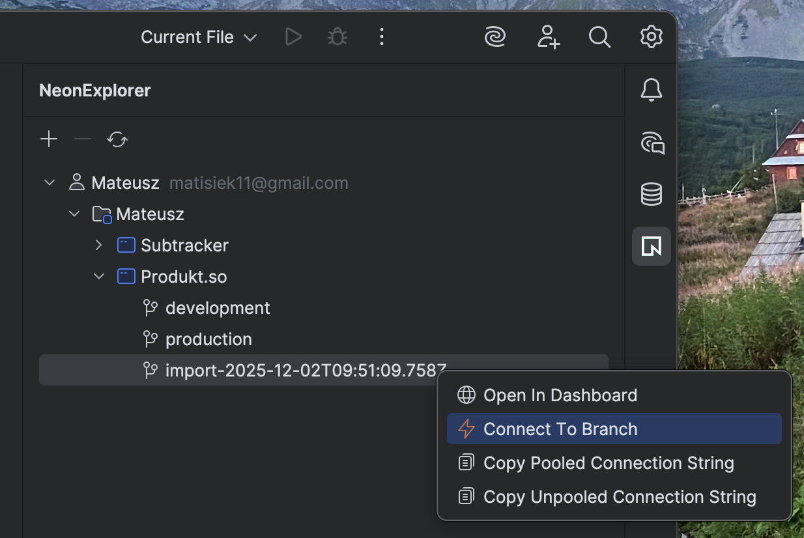

# IntelliNeon ⚡

IntelliNeon is a JetBrains IDE plugin that provides seamless integration with [Neon](https://neon.tech), the serverless PostgreSQL database. It allows you to manage your Neon accounts, projects, and branches directly within your IDE.

## Features

- **Neon Explorer**: A dedicated tool window to browse your Neon organizations, projects, and branches.
- **Connection Management**: Easily connect to your Neon branches and add them as DataSources in the IDE's Database tool.
- **Connection Strings**: Copy connection strings (pooled and non-pooled) for your Neon branches with a single click.
- **Multi-Account Support**: Manage multiple Neon accounts simultaneously.
- **Branch Management**: View and interact with your Neon project branches.

## Screenshots

### Neon Explorer

## Installation

You can install IntelliNeon directly from the JetBrains Marketplace within your IDE:

1. Open **Settings/Preferences** (`Cmd+,` on macOS, `Ctrl+Alt+S` on Windows/Linux).
2. Navigate to **Plugins**.
3. Search for **IntelliNeon**.
4. Click **Install**.

Alternatively, you can download the plugin from the [JetBrains Marketplace website](https://plugins.jetbrains.com).

## Getting Started

1. After installation, locate the **Neon Explorer** tool window on the right side of your IDE.
2. Click the **+** icon in the toolbar to add your Neon account using an API Key.
3. Once authenticated, your organizations and projects will be loaded.
4. Expand a project to see its branches.
5. Right-click on a branch to:
    - **Connect to Branch**: Adds the branch as a DataSource in the IDE's Database tool window.
    - **Copy Connection String**: Copies the connection string (with or without pooling) to your clipboard.

## Requirements

- IntelliJ IDEA, WebStorm, PyCharm, or any other JetBrains IDE with the **Database** plugin support.
- Neon Account and API Key.

## License

This project is licensed under the MIT License - see the LICENSE file for details.
